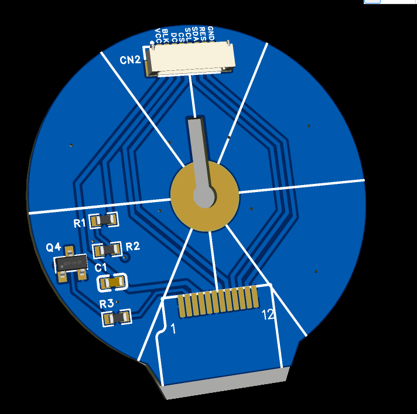
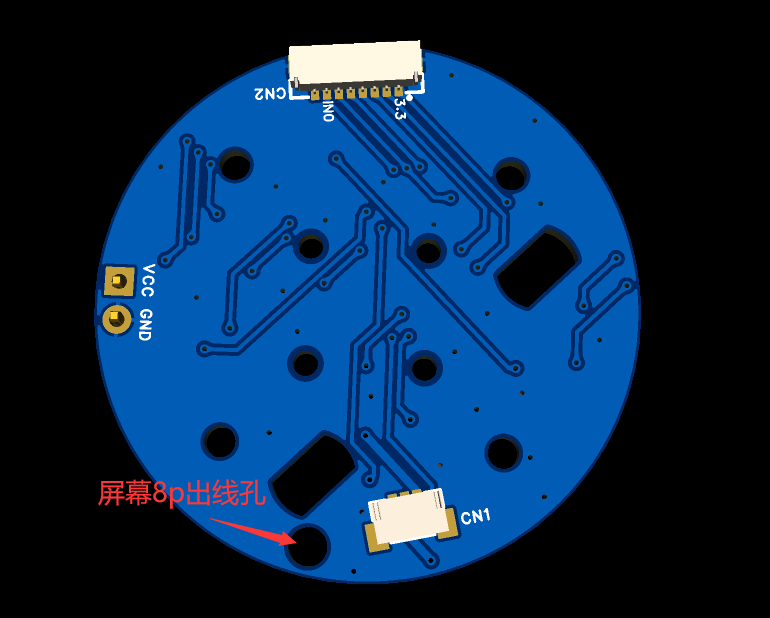
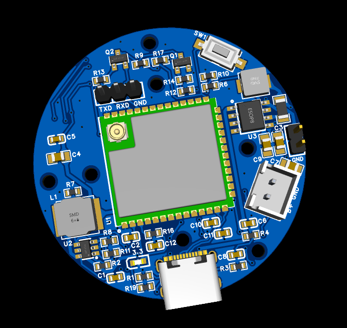
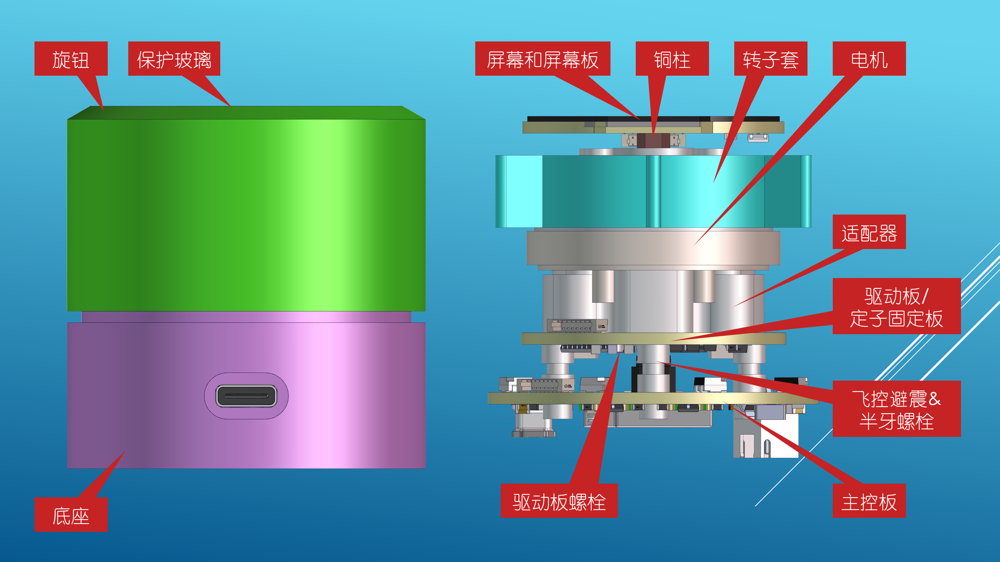

# Super Dial 电机旋钮屏
##更新日志
2022/10/10：原理图中usb5Vin 经过ip5036 再输出5v，会导致单usb供电的时候不稳定，会让电机控制或者蓝牙无法正常工作，暂时可以使用先usb和电池一起用。问题修复中，还没打板。
2022/11/11：发现程序之前mt6701磁编码器芯片用iic通信会有延迟现象，修改主控和电机驱动板的8p线走线，变成spi模式，磁编码器检测效果变好。不会出现力度突然大突然小的情况。（程序bin会后续修改，但是目前iic的程序可以在新版pcb上使用）

## 1.项目介绍
灵感来源与国外的smart konb，制作初衷为制作一个桌面力反馈旋钮，可以与电脑进行交互。项目从最重要的电机入手，选择了量大便宜的3205电机（小米云台电机的库存货），在结构上实现上下等大，增加实用功能蓝牙hid（轮盘功能），可实现与surface dial一样的功能。演示视频[“SuperDial电机旋钮——力反馈、多功能”](https://www.bilibili.com/video/BV1cG411c7QS)
## 2.制作说明
硬件构成esp32s3-n16r8，屏幕为gc9a01，3个pcb，4个打印件，若干结构件。具体在附件——[附件gitee链接](https://gitee.com/coll45/super-dial-motor-knob-screen)

pcb：

1. 屏幕板，中间需要焊接铜柱（铜柱尖角对准线，可以用m2.5螺丝先固定后焊接，然后取出螺丝），8p0.8线通过铜柱往下连接到主控板（穿过电机中心，铜柱固定在打印件-适配器上）　 下单屏幕板的时候注意备注： 不要半孔工艺

2.电机驱动板，含磁编码器。驱动芯片eg2133，磁编码器MT6701。穿过屏幕8p线后，驱动板通过螺丝固定在打印件-适配器上

3.主控板,固定在底座上，背面朝上，电池放底部。typec一定需要USB3.0，5V1A以上，可实现充电、单独给旋钮供电（未来可以支持usb-hid）主控板上的2.54插针都不要焊接。

## 结构说明
打印件可以通过三维猴打印，直接上传`3D打印和CNC模型-by虫二`文件夹内的stl即可，一共四个打印件（选择外壳cnc就用cnc的step）。不需要上传彩蛋，忽视壁厚小于0.8mm的警告，预计一套20-30。

## 代码烧录
打开附件文件夹内的`bin/flash_download_tool_3.9.2.exe` 选择esp32s3，什么都不改（test.bin烧录到0x0位置）。然后通过usb-ttl连接到主控板，tx-rx rx-tx gnd -gnd，连接完成之后，按住boot按钮（sw1）然后接入typec亮起3.3v指示灯，然后松开boot按钮，点start开始烧录。烧录完成后拔掉typec 再次插入就可以看见效果

## 源码
已经上传至gitee，开发环境为arduino - esp32s3-n16r8（自己装arduino环境会有一些错误，需要自行解决，例如LVGL库需要修改配置文件）

## 未来计划（画饼）
项目初衷是做pc的外设所以打算都是开发pc功能。有能力大佬可以在开源的基础上自行修改。

1.lvgl多级菜单实现多种界面效果（但是主要还是对pc设备win10系统的操作） 
2.pc性能监视器

## 沟通与交流
816782369（有CNC+SMT套件开车）

## 感谢与引用
非常感谢虫二大佬和立创的星火计划，让项目能够快速迭代落地。